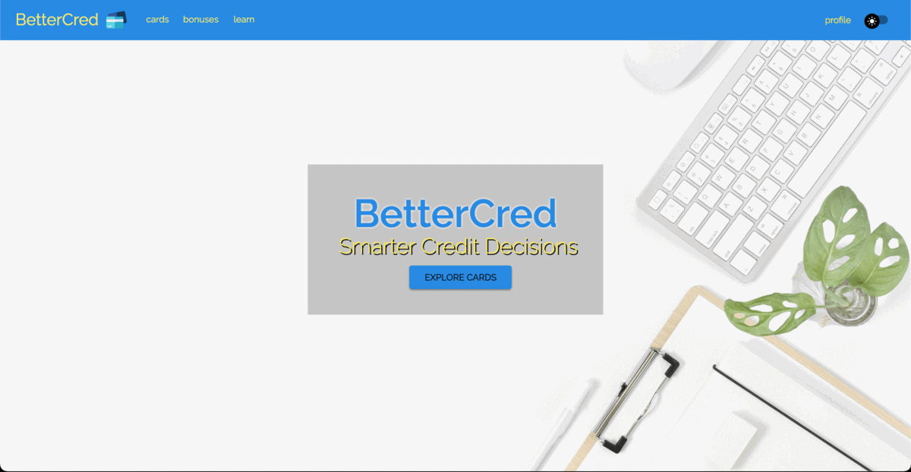
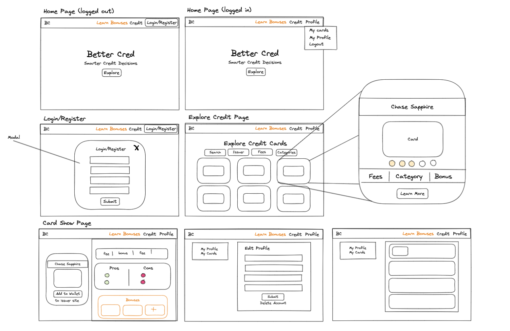
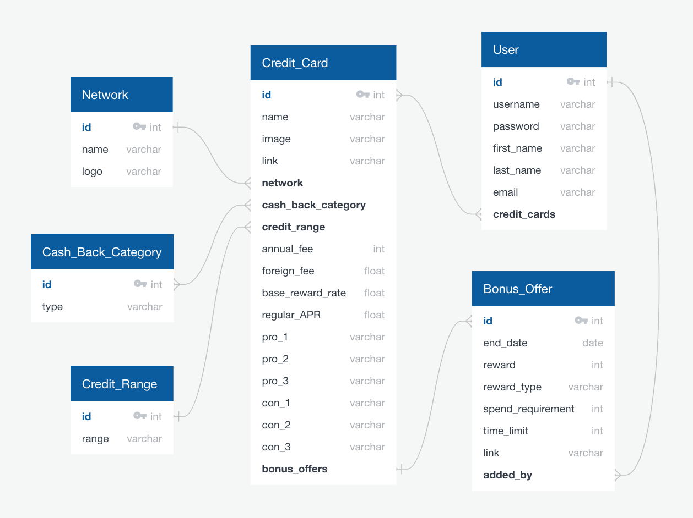

# Project 4: BetterCred

## Overview
This was the fourth project for the Software Engineering Immersive course with GA, which consisted of a one week solo full-stack project.

You can find the deployed version of the project [here](https://bettercred.herokuapp.com/).



## Navigation

* [Brief](#the-brief)
* [Technologies](#technologies)
* [Planning](#planning)
  * [Features](#features)
  * [Wireframing](#wireframing)
* [Coding](#coding)
  * [Search Feature](#search-feature)
  * [Favorites Feature](#add-to-wallet-feature)
* [Reflection](#reflection)
  * [Challenges](#challenges)
  * [Key Learnings](#key-learnings)
  * [Wins](#wins)
* [Future Features](#future-features)
* [Credits](#credits)

## The Brief

**Timeframe:**
* 9 days

**General Project Brief:**
* Build a full-stack application by making your own backend and your own front-end
* Use a Python Django API using Django REST Framework to serve your data from a Postgres database
* Consume your API with a separate front-end built with React
* Be a complete product which most likely means multiple relationships and CRUD functionality for at least a couple of models
* Implement thoughtful user stories/wireframes that are significant enough to help you know which features are core MVP and which you can cut
* Have a visually impressive design

## Technologies 

* JavaScript (ES6+)
* Python
* Django
* React & React Router
* Material UI (MUI)
* HTML5, CSS3, and SASS
* Axios
* VSCode
* Pylint
* Git & GitHub
* TablePlus
* Insomnia
* QuickDBD

## Planning

My initial plan for this project was to create an app that made it easy for users to browse many different credit cards, allowing them to find cards with the features that would be most useful based on their own lifestyle preferences. If a user decides they like a certain card, they'd be able to save them to their user profile in a virtual 'wallet' of sorts, which helps them organize the cards they may have already applied for or would like to apply for in the future.

### Features

* Homepage
* Login/Register forms in the form of modals
* Card Explore Page - topline information on different credit cards
* Card Show Page - more detailed information on a specific credit card
* Add to Wallet - users can add cards to their digital "wallet" by clicking a button on the card show page
* User Wallet Page - where a user can view cards they have saved to their wallet
* Edit Profile Page - change name, password, email, or username
* Responsive Design
* Dark Mode

### Wireframing

I spent a fair amount of time thinking through how I wanted the front-end to look like, having learned the importance of strong planning from previous projects, especially as I only had one week to work through the features I wanted to implement.



### Entity Relationship Diagram (ERD)

Planning out the back-end of the project allowed me to plan and prioritize which models I wanted to build and which fields each model would contain. By mapping out the different relationships, it made it relatively clear how I should build out my back-end and where I needed to establish relationships between PostgreSQL tables.



### Project Management

I used Asana to help myself stay organized and to keep track of pending tasks I had planned. Whenever I would catch a bug or discover something I needed to add to my agenda, I would enter each task into the board. Using this tool helped me visualize outstanding items I needed to tackle, as well as reflect on what I had finished and how I was progressing.

I also attended daily standups with my cohort in the program, where we could share with a larger group any problems or discoveries we wanted to discuss.

## Coding

### Back-End

Once the ERD using QuickDBD was drafted out, I worked to build out the different models, views, and serializers using Django and Python.

#### Models

I had several models planned out:
* Networks
* Cash Back Categories
* Credit Ranges
* Credit Cards
* Users
* Bonuses (if I had remaining time)

The Credit Card model was the most complex model, with several many-to-one and many-to-many relationships. The reason I chose to split out networks, cash back ranges, and credit ranges from Credit Cards was for filtering purposes, so it would make it easier to return back filtered for certain features, rather than potentially returning the full credit card array and then filtering it on the front-end.

```
class CreditCard(models.Model):
    name = models.CharField(max_length = 50)
    image = models.CharField(max_length = 500)
    link = models.CharField(max_length = 500)
    annual_fee = models.IntegerField(default = None)
    foreign_fee = models.FloatField(max_length=5)
    base_reward_rate = models.FloatField(max_length=5)
    regular_APR_min = models.FloatField(max_length=5)
    regular_APR_max = models.FloatField(max_length=5)
    pro_1 = models.CharField(max_length = 75, blank = True)
    pro_2 = models.CharField(max_length = 75, blank = True)
    pro_3 = models.CharField(max_length = 75, blank = True)
    con_1 = models.CharField(max_length = 75, blank = True)
    con_2 = models.CharField(max_length = 75, blank = True)
    con_3 = models.CharField(max_length = 75, blank = True)
    issuer = models.ForeignKey('issuers.Issuer', related_name = 'credit_cards', on_delete = models.PROTECT, default = None)
    network = models.ForeignKey('networks.Network', related_name = 'credit_cards', on_delete = models.PROTECT, default = None)
    cash_back_category = models.ManyToManyField('cash_back_categories.CashBackCategory', related_name = 'credit_cards', blank = True)
    credit_range = models.ForeignKey('credit_ranges.CreditRange', related_name = 'credit_cards', on_delete = models.PROTECT, default = None)
    # bonus_offers = models.ManyToOneRel
```

#### User Authentication

I had to create several different views to handle user login and registration requests, most of which was relatively straightforward. For the login request, I defined a view that would return a jwt token encoding the userID and token expiration date to the payload if the request data was valid.

```
class LoginView(APIView):

    # POST - Login a user and return a token
    def post(self, request):

        # Save username and password from request to variables
        username = request.data.get('username')
        password = request.data.get('password')

        # Try to find user, if not found, return an ambiguous error
        try:
            user_to_login = User.objects.get(username = username)
        except User.DoesNotExist:
            raise PermissionDenied('Invalid credentials.')
        
        # If user is found but password does not match, return error
        if not User.check_password(user_to_login, password):
            raise PermissionDenied('Invalid credentials.')
        
        # ? Now that the username/password checks out, we can create and return a token
        # Get time one week for now for use in token exp
        exp_time = datetime.now() + timedelta(weeks = 1)

        # Encode token using jwt
        token = jwt.encode(
            {
                'sub': user_to_login.id,
                'exp': int(exp_time.strftime('%s')),
            }, 
            settings.SECRET_KEY,
            'HS256'
        )

        # Return response with token
        return Response(
            { 
                'message': f'Welcome back {user_to_login.first_name}!',
                'token': token,
            },
            status.HTTP_202_ACCEPTED
        )
```

#### Adding Card to Wallet

Users can add or delete cards from their wallets. To handle this on the back-end, I created a view for requests to a unique endpoint `/profile/<int:pk>/wallet` that passed in the unique id of the specific credit card, then handled either POST and DELETE requests.

```
# POST - add card to user wallet
    def post(self, request, pk):
        cardId = request.data.get("cardId")

        # Check if request user is right user
        self.check_user(request.user.id, pk)

        # Get User and Card objects
        user = self.get_object(User, pk)
        card = self.get_object(CreditCard, cardId)

        # Add Card to User Wallet
        user.wallet.add(card)

        # Serialize User
        serialized_user = PopulatedUserSerializer(user)

        # Return User and 202 status
        return Response(serialized_user.data, status.HTTP_201_CREATED)

    def delete(self, request, pk):
        cardId = request.data.get("cardId")

        # Check if request user is right user
        self.check_user(request.user.id, pk)

        # Get User and Card objects
        user = self.get_object(User, pk)
        card = self.get_object(CreditCard, cardId)

        # Delete card from wallet
        user.wallet.remove(card)

        # Return User and 204 status
        return Response(status = status.HTTP_204_NO_CONTENT)
```

### Front-End

The front-end took up a majority of the time spent on the project. I built the front-end using React and Material UI.

#### Login/Register Modals

Rather than building out specific pages for user login and register, I opted for modals that would display over the current page the user was on, keeping the login/register experience more seamless. At first, one issue I ran into was trying to figure out how to switch between the two modals (ex. opening up the login modal from the register modal). To solve this, I defined the state of the Login/Register modal from the Navbar, then passed them down to both the Login/Register components as props, so I could set both states out of either component.

```
  // swapping from Join modal to Login modal
  const handleSwap = () => {
    setJoinOpen(false)
    setLoginOpen(true)
  }
```

#### User Profile

For the user profile, I created a sidebar that would allow users to switch between two menu options, "My Profile" or "My Wallet", without the need of reloading the page. I achieved this by toggling between two different components, handling the swap with a handleMenu function that would underline the active component and update the current component shown.

```
  const handleMenu = (e) => {
    if (e.target.innerHTML === 'my profile') {
      setCurrentPage('my profile')
      setEditProfileDeco('underline')
      setMyCardsDeco('none')
    }

    if (e.target.innerHTML === 'my cards') {
      setCurrentPage('my cards')
      setMyCardsDeco('underline')
      setEditProfileDeco('none')
    }
  }
```

## Reflection

### Challenges

I think a major challenge for this project was managing expectations and prioritization. I was a bit ambitious at the beginning of the week, with several features I was hoping to build into my project. As the deadline for the project approached, I found myself wishing I had prioritized certain features of others. For example, in retrospect I would have rather worked to roll out more robust filtering/sorting of credit cards on the Explore page in place of more aesthetic features like dark mode.

### Key Learnings

I

### Wins

I think the biggest wins for this project include:
* Building a full-stack application solo under a tight deadline
* Incorporating animations and MUI components for a visually appealing design
* Creating a REST API and creating serializiers, populated serializers, and capability for user authentication

## Future Features

There was a lot more I wish I could have built out for this project, some of which I may continue to work on to further develop this app. Some of the ideas missed included:
* More robust filtering and sorting for the credit card explore page
* Expanding credit card search to allow users to search beyond just credit card name, but also through other fields
* Looking into web scraping to more easily pull credit card information out of websites to populate the database
* A "Bonus" section to the site that contains active credit card bonus offers that users can filter through
* Adding a "Learn" section to the site containing articles for further reading for users who want to learn about credit, credit cards, etc.
* Down the line, maybe even a forum for users to discuss amongst themselves
 * In which case, adding capability for users to set their profile picture, and incorportating cloud storage for uploaded images

## Credits:

* Images
  * [NerdWallet](https://www.nerdwallet.com/)

* Fonts
  * [Raleway](https://fonts.google.com/specimen/Raleway)
